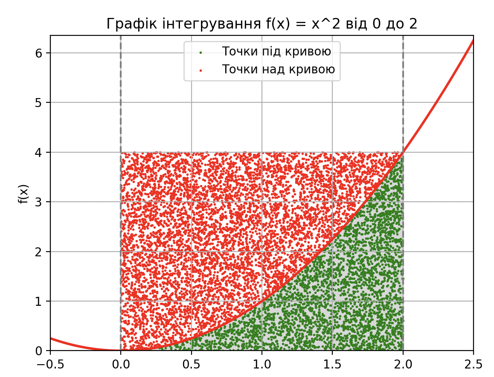
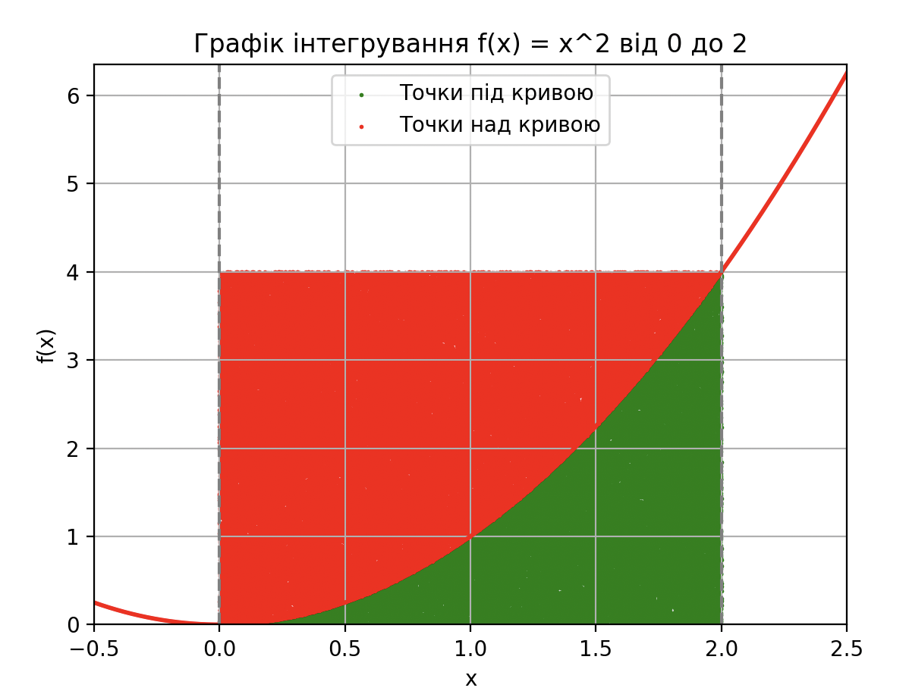

### HM 10 PULP & Monte-Carlo

##### Результати

```
# Проміжні результати під час виконання з 10'000 точок
Теоритична площа інтегралу: 2.6666666666666665 з похибкою 2.9605947323337504e-14
Площа інтегралу за методом Монте-Карло: 2.7448
```



```
# Проміжні результати під час виконання з 100'000 точок
Теоритична площа інтегралу: 2.6666666666666665 з похибкою 2.9605947323337504e-14
Площа інтегралу за методом Монте-Карло: 2.674
```



##### Висновки

Точність алгоритму Монте-Карло залежить від кількості згенерованих точок. Метод Монте-Карло ефективний для швидкого аналізу і оцінки граничних значень, особливо коли абсолютна точність не є критично важливою. Зі збільшенням кількості точок для генерації результатів помітно зростає обчислювальна складність.
